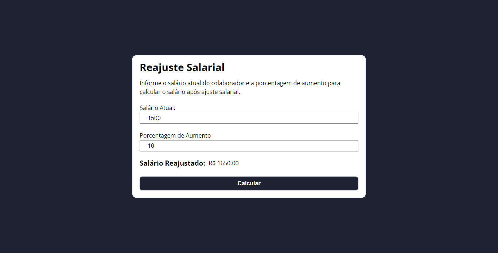

# Reajuste Salarial

Entrega da atividade #03 da matéria de Programação WEB com o objetivo de desenvolver uma página que permite o calculo de reajuste salarial de um funcionário. 

## Table of contents

- [Sobre a Atividade](#sobre-a-atividade)
- [Screenshot](#screenshot)
- [Links](#links)
- [Feito Com](#feito-com)
- [O que Aprendi](#o-que-aprendi)

## Sobre a Atividade

Usuários devem ser capazes de:

- Ver o layout otimizado dependendo do tamanho do dispositivo em que estão acessando a página.
- Calcular corretamente o reajuste salarial de um funcionário

## Screenshot

> 

## Links

- Live Site URL: [Site](https://daviidsantos.github.io/reajuste-salarial/)

## Feito Com

- JavaScript
- HTML 5 Semântico
- CSS 3
- Flexbox

## O que Aprendi

Aprendi a como manipular o DOM utilizando o JavaScript
